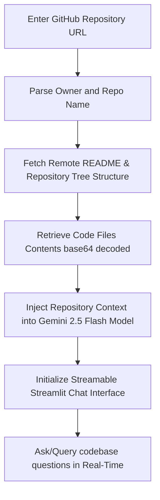

# 🤖 Repo Explainer: AI-Powered GitHub Repository Analyzer

[](https://www.python.org/)
[](https://streamlit.io/)
[](https://deepmind.google/technologies/gemini/)

An interactive web application powered by **Streamlit** and **Google Gemini 2.5 Flash** that allows developers to enter any public GitHub repository URL, analyze its structure and source files in real-time, and chat with a specialized AI coding assistant specifically guided by that codebase.

---

## 🚀 Key Features

*   📂 **Automated Codebase Mapping:** Recursively parses the GitHub repository structure to map out the folder hierarchy and retrieve files (`.py`, `.html`, `.css`, `.js`, `.jsx`, `.rst`, `.md`).
*   🧠 **Context-Aware AI Chat:** Feeds the repository codebase context directly into **Gemini 2.5 Flash**, giving you a virtual senior developer who understands your architecture, files, and specific functions.
*   ⏱️ **Real-Time Streaming Responses:** Outputs responses using dynamic streaming for interactive, conversational flow.
*   🛡️ **Rate-Limit Handling:** Supports authorization using GitHub personal access tokens to handle large repositories without running into GitHub API rate limits.
*   💻 **Sleek UI/UX:** Clean, intuitive chat layout built with native Streamlit components.

---

## 🛠️ Architecture & Workflow

Here is how the repository analysis flow works under the hood:



---

## 📂 Project Structure

```bash
├── .streamlit/
│   └── secrets.toml        # Local API secrets configuration (keys)
├── app.py                  # Main Streamlit application and Chat UI
├── utils.py                # GitHub API retrieval & repository parsers
└── README.md               # Project documentation
```

---

## ⚡ Setup & Installation

To run this application locally on your machine, follow these steps:

### 1. Clone the Repository

```bash
git clone https://github.com/Shashank1725/An-AI-powered-GitHub-Repository-Analyzer.git
cd An-AI-powered-GitHub-Repository-Analyzer
```

### 2. Set Up a Virtual Environment (Optional but Recommended)

```bash
# Create virtual environment
python -m venv venv

# Activate virtual environment
# On macOS/Linux:
source venv/bin/activate
# On Windows:
venv\Scripts\activate
```

### 3. Install Dependencies

Install the required Python packages:

```bash
pip install streamlit requests google-generativeai
```

### 4. Configure API Keys & Secrets

Create a `.streamlit/secrets.toml` file inside the root directory and add your Google Gemini API Key and GitHub Personal Access Token (for high API rate limits):

```toml
GOOGLE_API_KEY = "YOUR_GOOGLE_AI_STUDIO_API_KEY"
GITHUB_TOKEN = "YOUR_GITHUB_PERSONAL_ACCESS_TOKEN"
```

> [!TIP]
> Alternatively, you can export these as environment variables (`GOOGLE_API_KEY` and `GITHUB_TOKEN`).

---

## 📖 Usage Guide

1.  **Launch the app:** Run the Streamlit server from your terminal:
    ```bash
    streamlit run app.py
    ```
2.  **Access the interface:** Open `http://localhost:8501` in your browser.
3.  **Analyze a repository:** Paste a link to any public GitHub repository (e.g., `https://github.com/Shashank1725/An-AI-powered-GitHub-Repository-Analyzer`).
4.  **Chat with the codebase:** Once files are fetched, ask any question about the architecture, function implementations, debugging, or optimization!

---

## 📝 Gemini System Instructions & constraints

To deliver high-quality, actionable programming advice, the underlying Gemini agent operates under the following rules:
*   🔑 **Codebase Grounding:** Answers questions strictly based on the retrieved directory tree, README, and source files.
*   💬 **Succinctness:** Short, polite, and direct answers without unnecessary filler.
*   📝 **Formatting Control:** Avoids large markdown title headers inside replies and uses backticks (`` ` ``) whenever citing file names, variables, functions, or directories for optimal clarity.
